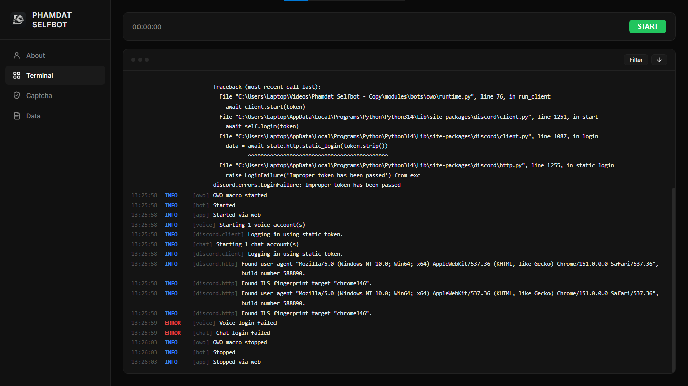
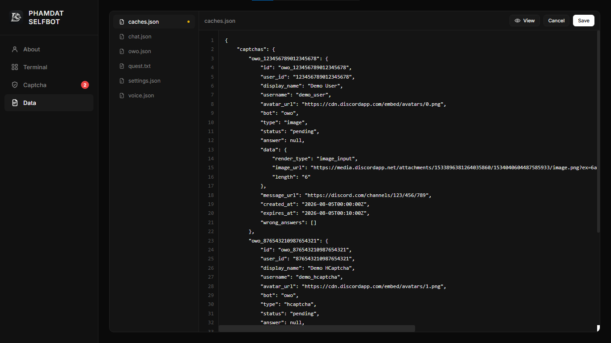
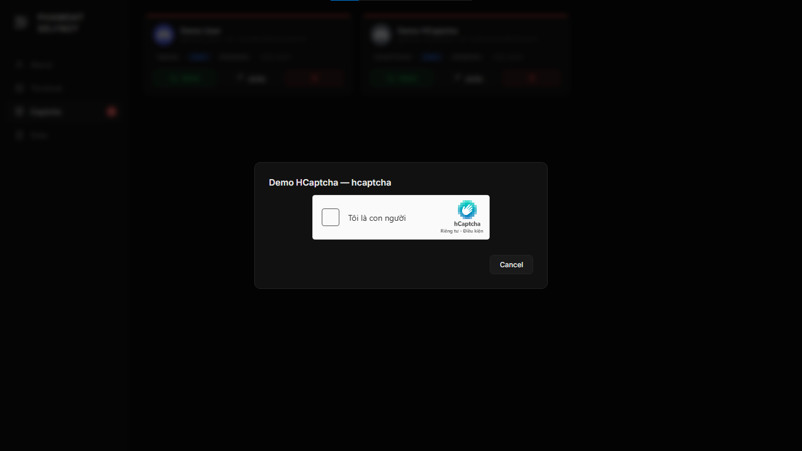

<p align="center">
  
</p>

---

## PREVIEW

<details>
<summary><b>Terminal</b></summary>

<p align="center">
  
</p>

</details>

<details>
<summary><b>Data</b></summary>

<p align="center">
  
</p>

</details>

<details>
<summary><b>Captcha</b></summary>

<p align="center">
  
</p>

</details>

---

## ABOUT

| | |
|---|---|
| **GitHub** | [github.com/realphamdat/phamdat-selfbot](https://github.com/realphamdat/phamdat-selfbot) |
| **Profile** | [realphamdat.github.io](https://realphamdat.github.io) |
| **Discord** | [discord.gg/GhfuaDTWQY](https://discord.gg/GhfuaDTWQY) |
| **Youtube** | [youtu.be/gqtXxDjQlhg](https://youtu.be/gqtXxDjQlhg) |
| **Render** | [youtu.be/9LdrSc7xH-o](https://youtu.be/9LdrSc7xH-o) |

---

## INSTALLATION

**Requirements**

- **Python** – [python.org](https://www.python.org/downloads/).  
  During installation, check **Add Python to PATH** so you can run `python` from any folder.

- **Git** – [git-scm.com](https://git-scm.com/install/windows).  
  Required because one dependency is installed directly from GitHub.

- **Chrome for Testing** – [googlechromelabs.github.io/chrome-for-testing](https://googlechromelabs.github.io/chrome-for-testing).  
  Choose the build for your operating system (required for the top.gg voting feature). Reference image: [assets/tips/chrome_binary.png](assets/tips/chrome_binary.png)

**Get the code**

- **Download ZIP** - on the [repo page](https://github.com/realphamdat/phamdat-selfbot), press *Code* then *Download ZIP*, and extract the folder.
- **Or clone** - open a terminal anywhere:

```bash
git clone https://github.com/realphamdat/phamdat-selfbot.git
```

**Install dependencies**

Open a terminal inside the project folder and run:

```bash
pip install -r requirements.txt
```

**Add your data**

Put your settings and tokens into the `data/` folder first - this is covered in [SETUP](#setup). The tool reads these files when it starts.

**Run**

```bash
python main.py
```

The tool starts a local web page. Open `http://localhost:2010` in your browser to **start/stop the macro, solve captchas and edit your data**. From another device on the same network, open `http://<IP shown in terminal>:2010`.

---

## SETUP

Everything lives in the `data/` folder. Edit the files, then press **Start** on the web UI - every start reloads all accounts from disk. Fill a file to turn its module on, empty it to turn it off.

<details>
<summary><b>MODULES & MULTI-ACCOUNT</b></summary>

| Module | Kind | File | Purpose |
|--------|------|------|---------|
| OwO | Bot | `owo.json` | Full OwO farm (daily, quests, hunt, gamble...) |
| Quest | Extension | `quest.txt` | Discord quest auto-completer |
| Top.gg | Extension | `topgg.txt` | Top.gg voter |
| Command | Extension | `command.txt` | Multi-account command runner |

Each module reads only its own file - list an account in each file where you want it to work.

In `owo.json` the top-level key is a Discord account token - each key is one account. Add a key to add an account, delete it to remove one.

```json
{
    "TOKEN_A": { "...": "..." },
    "TOKEN_B": { "...": "..." }
}
```

The plain-text files take one entry per line, `#` starts a comment.

**Data types** (JSON files)

| Type | Meaning | Example |
|------|---------|---------|
| String | text, inside quotes | `"owo"` |
| Number | a number, no quotes | `12` |
| Boolean | true or false, no quotes | `true` |
| List | several values inside `[ ]` | `[1, 2, 3]` |
| Object | a nested group inside `{ }` | `{"min": 5, "max": 10}` |

**Rules to know**

- A key you leave out keeps its **default** value. A minimal account is just `"YOUR_TOKEN": {}`.
- Use a **list** to allow several IDs (channels, ...). Use a plain number for a single ID.
- `settings.json` is **global** and is not keyed by token. `caches.json` is written by the tool - do not edit it.

</details>
<details>
<summary><b>OwO</b>  -  Bot  -  <code>data/owo.json</code></summary>

The full OwO farm: hunt, battle, daily, quests, huntbot, giveaway, boss, gems and gambling.

```json
{
    "YOUR_TOKEN": {
        "prefix": "owo",
        "channels_id": [123456789],
        "daily": true,
        "spam": { "hunt": true, "battle": true }
    }
}
```

**Top level**

| Key | Type | Default | Purpose |
|-----|------|---------|---------|
| `prefix` | String | `owo` | Prefix for every OwO command |
| `check_status` | Boolean | `true` | Pause the account if OwO seems offline |
| `channels_id` | List | `[]` | Channels this account can work in |
| `changing_channel` | Object | *(below)* | When to switch between channels |
| `checklist` | Boolean | `true` | Complete OwO checklist |
| `quest` | Boolean | `true` | Complete OwO quests |
| `vote` | Boolean | `true` | Vote OwO in top.gg |
| `daily` | Boolean | `true` | Claim the daily reward |
| `boss` | Boolean | `true` | Join guild boss battles |
| `huntbot` | Boolean | `true` | Claim huntbot rewards and submit passwords |
| `giveaway` | Boolean | `true` | Join giveaways |
| `spam` | Object | *(below)* | The hunt / battle / owo loop |
| `gem` | Object | *(below)* | Gem usage and opening inventory |
| `gamble` | Object | *(below)* | Gambling games |

**changing_channel** - needs more than one channel in `channels_id`:

| Key | Type | Default | Purpose |
|-----|------|---------|---------|
| `when_mentioned` | Boolean | `true` | Switch channel when the account is mentioned |
| `when_challenge` | Boolean | `true` | Switch channel after a battle challenge |
| `after_elapsed_time` | Object | `{"min": 300, "max": 600}` | Switch after a random time (seconds) |

**spam** - the XP loop:

| Key | Type | Default | Purpose |
|-----|------|---------|---------|
| `hunt` | Boolean | `true` | Send the hunt command |
| `battle` | Boolean | `true` | Send the battle command |
| `owo/uwu` | Boolean | `true` | Send a random `owo` or `uwu` |
| `delay` | Object | `{"min": 0.5, "max": 1}` | Pause between commands (seconds) |
| `cooldown` | Object | `{"min": 15, "max": 20}` | Pause between cycles (seconds) |

**gem**:

| Key | Type | Default | Purpose |
|-----|------|---------|---------|
| `use` | Boolean | `false` | Auto-use a gem when the account gains one |
| `couple` | Boolean | `true` | Use the couple gem combo |
| `best` | Boolean | `false` | With `use`, use the highest-tier gem |
| `star` | Boolean | `false` | Also use the star gem |
| `glitch` | Boolean | `true` | Check the double-time glitch |
| `openning` | Object | *(below)* | Auto-open items in the inventory |

**openning** (inside `gem`):

| Key | Type | Default | Purpose |
|-----|------|---------|---------|
| `box` | Boolean | `true` | Open lootboxes |
| `crate` | Boolean | `true` | Open crates |
| `flootbox` | Boolean | `false` | Open the special flootboxes |

**gamble**:

| Key | Type | Default | Purpose |
|-----|------|---------|---------|
| `lottery` | Object | *(below)* | Lottery |
| `slot` | Object | *(below)* | Slot machine |
| `coinflip` | Object | *(below)* | Coin flip |
| `blackjack` | Object | *(below)* | Blackjack |
| `highlow` | Object | *(below)* | High / low |
| `delay` | Object | `{"min": 10, "max": 15}` | Pause between games (seconds) |
| `cooldown` | Object | `{"min": 30, "max": 60}` | Pause between cycles (seconds) |

Each game has a `mode` switch (default `false`) to turn it on. All games are off by default.

| Game | `mode` | `bet` | `rate` | `max` |
|------|--------|-------|--------|-------|
| slot | false | 1 | 2 | 250000 |
| coinflip | false | 1 | 2 | 250000 |
| blackjack | false | 1 | 2 | 250000 |
| highlow | false | 10 | 2 | 250000 |

For every game: `bet` is the base bet (highlow is forced to a minimum of 10), `rate` multiplies the next bet after a loss and `max` is the highest bet allowed. `lottery` uses `amount` (default `1`) - its tickets per daily reset.

When **two or more** accounts are set up, friend quests (battle, cookie, pray, curse, action) are solved by the other accounts automatically.

</details>
<details>
<summary><b>Quest</b>  -  Extension  -  <code>data/quest.txt</code></summary>

Completes Discord quests (watch a video, play on desktop, stream, play an activity). This is a different thing from the OwO `quest` key above - it is for Discord's own quest system. It talks to Discord's HTTP API directly, so it does not use the bot gateway. All tokens run together.

```txt
# one token per line
TOKEN_A
TOKEN_B
```

There is nothing else to configure.

</details>
<details>
<summary><b>Top.gg</b>  -  Extension  -  <code>data/topgg.txt</code></summary>

Votes for any bot on top.gg. This is a different thing from the OwO `vote` key above - that one votes the OwO bot with the account's own token, this one votes any bot id with any token. It opens Chrome for Testing for every vote, so the browser from the requirements is required.

```txt
# one token + one bot id per line
TOKEN_A 408785106942164992
TOKEN_B 408785106942164992
```

After a successful vote, the account waits for the top.gg cooldown before it votes again. There is nothing else to configure.

</details>
<details>
<summary><b>Command</b>  -  Extension  -  <code>data/command.txt</code></summary>

Runs many accounts from one message. Each account listens to its listed owners; when an owner sends a message starting with one of the listed prefixes, every account under that owner executes the same command, staggered by a random 1-2 second delay so the sends do not look synchronized.

```txt
# TOKEN  owner_ids(comma separated)  prefixes(comma separated)
TOKEN_A 111222333444555666,999888777666555444 !,.
TOKEN_B 111222333444555666 .
```

Messages sent by your own configured accounts are ignored - always send commands from an account that is not listed in this file.

The prefix can be a text prefix from the file **or a mention of the account itself** - both `<@USER_ID> say hello` and `<@!USER_ID> say hello` work, so you can just ping the account followed by the command.

Commands (with your prefix, e.g. `!say hello`):

| Command | Usage | Action |
|---------|-------|--------|
| `say` | `say [channel_id] <content>` | Send a message (current channel, or another channel by id) |
| `reply` | `reply <target> <content>` | Reply to a specific message |
| `edit` | `edit <target> <content>` | Edit your own message |
| `delete` | `delete <target>` | Delete your own message |
| `react` | `react <emoji> <target>` | Add a reaction |
| `unreact` | `unreact <emoji> <target>` | Remove your reaction |
| `click` | `click <target> [button]` | Click a button on a message (first one by default) |
| `select` | `select <target> <option> [menu]` | Choose an option from a select menu |
| `items` | `items <target>` | List the buttons and menus of a message to the terminal log |
| `accounts` | `accounts` | Report account status to the terminal log |

`<target>` is flexible: `.` = the newest message in the channel, a bare message id searches recent history, or use a jump link (`https://discord.com/channels/@me/123/456`) / `channelID-messageID` for any channel. Buttons and menus are matched by number, label or custom_id and are found inside nested components (action rows, containers, sections...) automatically.

Examples: `!click .`, `!react 👍 .`, `!items .`, `!select . 2`

</details>

<details>
<summary><b>settings.json</b>  -  Global</summary>

Not keyed by token - one file for the whole tool. Optional.

When any account hits a captcha, the web app already shows it. If `discord_webhook` is set, the tool also posts a Discord alert so you get pinged (for example at night).

```json
{
    "discord_webhook": {
        "url": "https://discord.com/api/webhooks/...",
        "content": "@everyone @here <@&role_id> <@user_id>"
    }
}
```

| Key | Type | Default | Purpose |
|-----|------|---------|---------|
| `url` | String | *(none)* | Webhook URL that receives the alert |
| `content` | String | `@everyone @here` | Mention text sent with the alert |

Each alert sends your `content` mentions plus an embed titled **CAPTCHA DETECTED** with the account's name and a link to the captcha message.

</details>

---

## IMPORTANCE

### Tips

- **Open the web UI from another device** on the same network: `http://<IP printed in terminal>:2010`.
- **Avoid using overly short or generic names** such as "bear", "pink", ".,;:?!@#$%^&*" or similar. These names are highly likely to overlap with other players, which can confuse the system during message recognition and may even cause serious errors. Choose a distinct, clear, and uncommon name instead. A name like "Phamdat" can still work if it is not commonly used, because the system relies on the name to accurately match bot replies.
- **Do not attach too many accounts to the same channel**. Doing so can flood the message flow, reduce efficiency, and make the system less reliable. If it is unavoidable, proceed with caution and only when absolutely necessary.

### OwO

- **Do not let the inventory become too large**. An overloaded inventory can trigger excessive message overflow, and the system may only recognize the first inventory message while later ones are skipped. This prevents important information from being scanned correctly. Avoid buying large quantities of rings, stacking thousands of boxes, crates, and other bulk inventory items. A case in point is [assets/tips/owo_inventory.png](assets/tips/owo_inventory.png)
- **Checklist/Quest features require the correct OWO settings**. To make checklist/quest work properly, you must configure the settings from the `owobs` command, as shown in the image at [assets/tips/owo_settings.png](assets/tips/owo_settings.png). Without this setup, the checklist/quest system may not function correctly.

---

## License

This project is licensed under the **Phamdat Selfbot - Educational License**. See [LICENSE](LICENSE) for details.

- Educational use only.
- Selling or commercial use is strictly prohibited.
- Credit required when referencing or borrowing code.
- Provided "as is" - the author assumes no liability for misuse or any consequences arising from use.