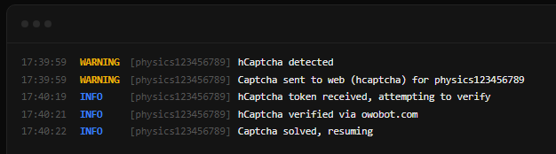

<p align="center">
  
</p>

## Previews

<table align="center">
  <tr>
    <td align="center"><br>Terminal</td>
    <td align="center"><br>Data</td>
  </tr>
  <tr>
    <td align="center"><br>Captcha</td>
    <td align="center"><br>Solve</td>
  </tr>
</table>

## About

| | |
|---|---|
| **GitHub** | [github.com/realphamdat/phamdat-selfbot](https://github.com/realphamdat/phamdat-selfbot) |
| **Profile** | [realphamdat.github.io](https://realphamdat.github.io) |
| **Discord** | [discord.gg/GhfuaDTWQY](https://discord.gg/GhfuaDTWQY) |
| **Youtube** | [youtu.be/gqtXxDjQlhg](https://youtu.be/gqtXxDjQlhg) |

---

## Installation

**Requirements:** Python 3.10+ (64-bit), Git.

```bash
git clone https://github.com/realphamdat/phamdat-selfbot.git
cd phamdat-selfbot
pip install -r requirements.txt
python main.py
```

The terminal prints a web address (e.g. `http://192.168.1.10:2010`). Open it in your browser:

| Tab | What it's for |
|---|---|
| **Terminal** | Start / stop the bots, live logs |
| **Captcha** | Solve pending captchas |
| **Data** | Edit config files |

---

## Configuration

Each config file is a JSON object where every **key is a Discord token** — one account per key, handled separately. Add a token key → add an account; remove it → remove the account.

<details>
<summary><b>owo.json</b> — OwO bot macro</summary>

Runs the full OwO macro per account: hunt, battle, daily, quests, huntbot, giveaways, guild boss, gems and gambling.

```json
{
    "YOUR_TOKEN": {
        "channels_id": [123456789]
    }
}
```

**Top level**

| Property | Type | Default | What it does |
|---|---|---|---|
| `prefix` | string | `owo` | OwO command prefix — `{prefix}h` sends `owoh` |
| `check_status` | bool | `true` | Probes OWO every 60 s; pauses the account 5–10 min if OWO stops replying |
| `channels_id` | array of int | `[]` | Channels the account may work in — one is picked randomly at startup |
| `changing_channel` | object | — | Channel-rotation behavior (below) |
| `daily` | bool | `true` | Auto-claim `{prefix}daily`, waits exactly the duration OWO reports |
| `quest` | bool | `true` | Auto-read, claim & complete OWO quests |
| `huntbot` | bool | `true` | Claim huntbot rewards and submit huntbot passwords |
| `giveaway` | bool | `true` | Auto-join `New Giveaway` messages |
| `boss` | bool | `true` | Join guild boss battles |
| `spam` | object | — | XP-farming command loop (below) |
| `gem` | object | — | Gem usage & inventory handling (below) |
| `gamble` | object | — | Slot, coinflip, blackjack, highlow, lottery (below) |

**`changing_channel`** — needs more than one ID in `channels_id`; a single ID means no rotation at all.

| Property | Type | Default | What it does |
|---|---|---|---|
| `when_mentioned` | bool | `true` | Switch channel when the account gets mentioned |
| `when_challenge` | bool | `true` | Switch channel after accepting a battle challenge |
| `after_elapsed_time.min` | int | `300` | Minimum seconds between automatic rotations |
| `after_elapsed_time.max` | int | `600` | Maximum seconds between automatic rotations |

**`spam`** — the XP loop: one cycle of commands, then a random `cooldown` sleep, repeat.

| Property | Type | Default | What it does |
|---|---|---|---|
| `hunt` | bool | `true` | Send `{prefix}h` |
| `battle` | bool | `true` | Send `{prefix}b` (auto-skipped during "battle a friend" quests) |
| `owo/uwu` | bool | `true` | Send a plain `owo` or `uwu` |
| `delay.min` | number | `0.5` | Min random delay (s) between commands in a cycle |
| `delay.max` | number | `1` | Max random delay (s) between commands in a cycle |
| `cooldown.min` | int | `15` | Min random sleep (s) after a full cycle |
| `cooldown.max` | int | `20` | Max random sleep (s) after a full cycle |

**`gem`**

| Property | Type | Default | What it does |
|---|---|---|---|
| `use` | bool | `false` | Auto-use a gem when the account gains one (reacts to OWO "gained" messages) |
| `couple` | bool | `true` | Use the 5-gem couple combo when OWO says "spent 5 cowoncy and caught a…" |
| `best` | bool | `false` | `false` = lowest-tier gem, `true` = highest |
| `star` | bool | `false` | Also use the star gem when an active special pet exists |
| `glitch` | bool | `true` | Check the double-time glitch (`{prefix}dt`) every 10 min — runs even with `use: false` |
| `openning.box` | bool | `true` | Open lootboxes (`{prefix}lb all`) when in inventory |
| `openning.crate` | bool | `true` | Open crates (`{prefix}wc all`) when in inventory |
| `openning.flootbox` | bool | `true` | Open flootboxes (`{prefix}lb f`) when in inventory |

**`gamble`** — every game has `mode`, all off by default. `delay` / `cooldown` are shared.

| Game | Settings | Defaults | What it does |
|---|---|---|---|
| `lottery` | `mode`, `amount` | `false`, `1` | One `{prefix}lottery <amount>` submission per daily reset |
| `slot` | `mode`, `bet`, `rate`, `max` | `false`, `1`, `2`, `250000` | `{prefix}s <bet>` |
| `coinflip` | `mode`, `bet`, `rate`, `max` | `false`, `1`, `2`, `250000` | `{prefix}cf <bet>` |
| `blackjack` | `mode`, `bet`, `rate`, `max` | `false`, `1`, `2`, `250000` | `{prefix}bj <bet>` — reacts 👊 (hit) while points ≤ 17, 🛑 (stand) above |
| `highlow` | `mode`, `bet`, `rate`, `max` | `false`, `10`, `2`, `250000` | `{prefix}hl <bet>` — guesses Higher/Lower via buttons, cashes out at ×2 (min bet 10) |
| `delay.min` / `delay.max` | number | `0.5` / `1` | Random delay (s) between games in a cycle |
| `cooldown.min` / `cooldown.max` | int | `60` / `120` | Random sleep (s) after a full gamble cycle |

Martingale for all games: a loss multiplies the next bet by `rate`, a win (or hitting `max`) resets it to `bet`.

With 2+ accounts configured, friend quests (battle, cookie, pray, curse, action) are solved by the other accounts.

</details>

<details>
<summary><b>quest.txt</b> — Discord quests autocompleter</summary>

Plain text, **one token per line**. Lines starting with `#` are ignored — the only config file that isn't JSON.

```
# one token per line
TOKEN_A
TOKEN_B
```

Uses Discord's HTTP API directly. Every 5 minutes it fetches available quests, auto-accepts eligible ones and completes the supported types (watch video, play on desktop, stream, play activity), respects rate limits, and processes up to 100 quests in parallel.

</details>

<details>
<summary><b>chat.json</b> — auto-chat</summary>

Sends messages from `assets/messages.txt` (one message per line) into the channels you list — a random channel and a random message every time.

```json
{
    "YOUR_TOKEN": {
        "chat_channel_id": [123456789, 987654321],
        "cooldown": {"min": 60, "max": 120},
        "exist": false
    }
}
```

| Property | Type | Default | What it does |
|---|---|---|---|
| `chat_channel_id` | array of int | `[]` | Channels to send in (random pick per message). Empty → account skipped |
| `cooldown.min` / `cooldown.max` | int | `60` / `120` | Random seconds between messages |
| `exist` | bool | `false` | `false` = send then instantly delete (ghost). `true` = leave the message |

</details>

<details>
<summary><b>voice.json</b> — voice keep-connected</summary>

Keeps each account connected to a voice channel; every 60 s it checks the connection and reconnects if it dropped.

```json
{
    "YOUR_TOKEN": 123456789
}
```

The key is the account token, the value is the voice channel ID (a number — no quotes).

</details>

---

## Tips

1. **A captcha pauses an account** until solved on the Captcha tab. To get notified, set `url` under `discord_webhook` in `data/settings.json`.
2. **Open the web UI from another device** on the same network: `http://<IP printed in terminal>:2010`.
3. **`owo.json` reloads a few seconds after saving** while the macro is stopped. `chat.json`, `voice.json` and `quest.txt` load only at startup — restart the bot after editing them.

---

## License

This project is licensed under the **Phamdat Selfbot — Educational License**. See [LICENSE](LICENSE) for details.

- Educational use only.
- Selling or commercial use is strictly prohibited.
- Credit required when referencing or borrowing code.
- Provided "as is" — the author assumes no liability for misuse or any consequences arising from use.
