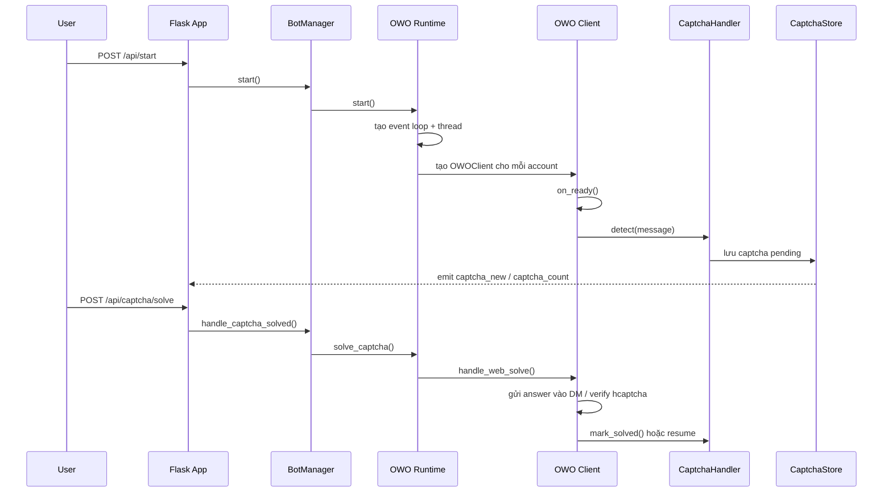

# Tổng hợp luồng hoạt động của dự án

## 1. Mục đích và phạm vi tài liệu

Tài liệu này mô tả toàn bộ luồng chạy chính của dự án theo đúng thứ tự thực thi trong code, từ khi khởi động chương trình cho tới khi bot dừng lại. Nội dung bao gồm:

- điểm vào ứng dụng
- luồng web server và API
- luồng khởi động BotManager
- luồng tạo và vận hành OWO client
- luồng phát hiện và xử lý captcha
- luồng lưu trữ dữ liệu và trạng thái
- luồng dừng chương trình và cleanup

Phạm vi này có chủ ý loại bỏ phần phân tích sâu từng task gameplay riêng lẻ như grind/quest/gamble/spam ở mức hành vi chi tiết. Những phần đó sẽ chỉ được nêu ở mức “được gọi như thế nào” và “điều kiện để kích hoạt”, vì đây là các task phụ thuộc vào cấu hình, trạng thái client và vòng lặp runtime chứ không phải là trung tâm của luồng điều phối.

---

## 2. Kiến trúc tổng quan

Dự án có 4 lớp chính:

1. Lớp entrypoint
   - [main.py](main.py)
   - Khởi tạo logging, tạo BotManager, gắn vào app, chạy server.

2. Lớp web và điều phối
   - [app.py](app.py)
   - Cung cấp Flask routes, Socket.IO, API cho start/stop/captcha/data/logs.

3. Lớp runtime bot
   - [bot.py](bot.py)
   - BotManager đóng vai trò trung tâm điều phối các tool.
   - [modules/tools/owo/runtime.py](modules/tools/owo/runtime.py)
   - Chịu trách nhiệm chạy event loop asyncio và quản lý các OWO client.

4. Lớp client và xử lý nghiệp vụ
   - [modules/tools/owo/client.py](modules/tools/owo/client.py)
   - Đại diện cho 1 account Discord OWO.
   - [modules/tools/owo/captcha.py](modules/tools/owo/captcha.py)
   - Xử lý captcha phát hiện và phản hồi.
   - [modules/tools/owo/task.py](modules/tools/owo/task.py)
   - Chạy các vòng lặp tác vụ nền như daily, huntbot, spam, gamble, channel change.

Ngoài ra còn có các module hỗ trợ:

- [modules/utils/captcha_manager.py](modules/utils/captcha_manager.py): tạo captcha payload và gửi tới web/frontend
- [modules/utils/captcha_store.py](modules/utils/captcha_store.py): lưu trữ captcha trong file JSON
- [modules/utils/data_store.py](modules/utils/data_store.py): đọc/ghi text JSON
- [modules/utils/logger.py](modules/utils/logger.py): logging + websocket log stream
- [modules/utils/oauth.py](modules/utils/oauth.py): OAuth cho hCaptcha verification

---

## 3. Luồng khởi động tổng thể

### 3.1 Bắt đầu từ entrypoint

Khi chạy chương trình, điểm vào đầu tiên là [main.py](main.py):

1. Gọi `setup_logging()` để thiết lập logger và stream handler.
2. Tạo một instance `BotManager()`.
3. Gọi `set_bot_manager(bot_manager)` để gắn bot manager vào biến toàn cục trong [app.py](app.py).
4. Gọi `run_server(host='0.0.0.0', port=2010)` để start Flask + Socket.IO.

Trong trường hợp chương trình bị dừng bằng Ctrl+C hoặc lỗi, `finally` sẽ gọi `bot_manager.stop()` để dừng mọi tool đang chạy.

### 3.2 Flask app được khởi tạo như thế nào

Trong [app.py](app.py), Flask app được tạo và cấu hình:

- `app = Flask(__name__)`
- `app.config['SECRET_KEY'] = "Phamdat Selfbot"`
- `socketio = SocketIO(app, cors_allowed_origins='*', async_mode='threading')`
- `get_ws_handler().set_socketio(socketio)` để bật log realtime qua websocket

Sau đó app đăng ký các route chính:

- `/` → about page
- `/dashboard` → dashboard page
- `/captcha` → captcha page
- `/data` → data page
- `/api/status`
- `/api/start`
- `/api/stop`
- `/api/captcha/list`
- `/api/captcha/solve`
- `/api/captcha/delete`
- `/api/data/files`
- `/api/data/read`
- `/api/data/write`
- `/api/logs`

---

## 4. Luồng start bot từ web

### 4.1 API start

Khi người dùng gọi `/api/start`:

1. Kiểm tra `bot_manager` đã được khởi tạo hay chưa.
2. Nếu bot đang chạy rồi thì trả về lỗi `Already running`.
3. Nếu chưa chạy thì gọi `bot_manager.start()`.
4. Ghi thời gian start vào biến `_start_time`.
5. Trả về `{ok: true}`.

### 4.2 BotManager.start()

Trong [bot.py](bot.py), `BotManager.start()` làm hai việc chính:

1. Đánh dấu `self.running = True`
2. Lặp qua toàn bộ tool có sẵn và gọi `tool.start()` nếu tool đó có method `start`

Hiện tại tool được đăng ký gồm:

- `owo` → [modules/tools/owo/runtime.py](modules/tools/owo/runtime.py)
- `discord_quest` → [modules/tools/discord_quest.py](modules/tools/discord_quest.py)

Với OWO tool, `runtime.start()` sẽ thực hiện việc tạo event loop asyncio và khởi tạo các account client.

---

## 5. Luồng runtime OWO

### 5.1 Khi OWO runtime start

Trong [modules/tools/owo/runtime.py](modules/tools/owo/runtime.py), `start()` làm:

1. Kiểm tra nếu runtime đã chạy thì bỏ qua.
2. Đánh dấu `running = True`
3. Gọi `migrate_owo_data()` để chuẩn hóa dữ liệu account
4. Gọi `CaptchaStore.normalize()` để chuẩn hóa captcha storage
5. Xóa state cũ: `clients.clear()`, `tasks.clear()`, `clients_by_user.clear()`
6. Tạo một event loop mới bằng `asyncio.new_event_loop()`
7. Tạo một thread mới chạy `run_loop()`
8. Gửi coroutine `start_accounts()` vào event loop bằng `asyncio.run_coroutine_threadsafe(...)`

### 5.2 run_loop()

`run_loop()` chỉ đơn giản là:

- gọi `asyncio.set_event_loop(loop)`
- gọi `loop.run_forever()`

Nghĩa là toàn bộ logic OWO chạy trong một event loop riêng, tách khỏi Flask main thread.

### 5.3 start_accounts()

`start_accounts()` đọc account từ file [data/owo.json](data/owo.json):

1. Gọi `load_accounts()`
2. `load_accounts()` dùng `deep_merge(OWO_DEFAULT_CONFIG, config)` để kết hợp cấu hình mặc định với cấu hình user
3. Với mỗi account token, tạo một `OWOClient`
4. Thêm vào `clients` list
5. Tạo task `run_client(client, token)` cho từng account

Mỗi client được khởi tạo với các thông tin quan trọng:

- token
- config
- shared_clients
- pending_captchas

---

## 6. Luồng lifecycle của một OWO client

### 6.1 Khởi tạo client

Trong [modules/tools/owo/client.py](modules/tools/owo/client.py), `OWOClient` kế thừa `discord.Client`.

Khi instance được tạo, nó thiết lập các thuộc tính sau:

- `self.bot_name` → tên bot, thường là `owo`
- `self.config` → cấu hình account sau khi merge defaults
- `self.prefix` → `owo`
- `self.owo_bot` → đối tượng bot OWO trong Discord
- `self.current_channel` và `self.current_channel_id`
- `self.selfbot_running` → trạng thái bot có được phép làm việc hay không
- `self.captcha_pending` → đang chờ captcha xử lý hay không
- `self.task_manager` → quản lý vòng lặp tác vụ
- `self.captcha_handler` → module xử lý captcha
- `self._pending_captchas` → danh sách captcha đang chờ xử lý từ web

### 6.2 on_ready()

Khi Discord client ready, `on_ready()` được gọi và làm các việc sau:

1. Chặn gọi lặp lại bằng `_on_ready_done`
2. Tìm bot OWO trong server bằng ID `408785106942164992`
3. Mở DM channel với bot OWO nếu cần
4. Gọi `Channel.init_channel(self)` để chọn một channel làm channel mặc định
5. Gắn `self.captcha_handler = CaptchaHandler`
6. Gắn `self.task_manager = TaskManager(self)`
7. Lọc danh sách captcha pending dành cho đúng user id hiện tại
8. Nếu có captcha pending thì:
   - đặt `self.captcha_pending = True`
   - tắt toàn bộ tính năng tự động bằng `self.selfbot_running = False` (nếu chưa được set)
   - gọi `await self.captcha_handler.process_pending(self, account_pending)`
   - nếu không có pending thì đặt `self.selfbot_running = True`
9. Gọi `await self.task_manager.start()` để bắt đầu vòng lặp task nền

Điểm quan trọng: nếu client vừa khởi động và có captcha pending thì nó sẽ không bắt đầu làm việc cho tới khi web xử lý captcha xong.

### 6.3 on_message()

Mỗi khi nhận message từ Discord:

1. Nếu message author là bot OWO thì cập nhật `last_owo_message_time`
2. Gọi `await self.captcha_handler.detect(self, message)` để xem đây có phải captcha không
3. Nếu `self.selfbot_running` đang false thì dừng ngay, không chạy các tác vụ tiếp theo
4. Nếu đang chạy thì tiếp tục gọi:
   - `Problem.check(self, message)`
   - `Channel.change_when_mentioned(self, message)`
   - `Channel.accept_challenge(self, message)`
   - `Quest.quest_progress(self, message)`
   - `Gem.check_gem(self, message)`

### 6.4 on_message_edit()

Dùng để xử lý phần chỉnh sửa message, chủ yếu liên quan tới:

- giveaway join
- slot/coinflip/gamble

---

## 7. Luồng task nền của client

### 7.1 TaskManager.start()

[modules/tools/owo/task.py](modules/tools/owo/task.py) tạo các task nền theo cấu hình. Những task được đăng ký gồm:

- offline check
- daily
- quest
- huntbot
- spam
- glitch
- gamble
- channel rotation

Mỗi task loop sẽ kiểm tra hai điều kiện trước khi chạy:

1. `self.client.selfbot_running` phải là True
2. Cấu hình tương ứng phải được bật

Nếu captcha đang pending thì client sẽ không chạy task, vì `selfbot_running` bị tắt.

### 7.2 Các task chính và ý nghĩa

- Daily loop: gửi lệnh daily và cập nhật cooldown
- Quest loop: gửi lệnh quest và bắt đầu quest workflow nếu cooldown đủ
- Huntbot loop: gửi lệnh huntbot và xử lý password captcha liên quan
- Spam loop: gửi các lệnh spam như owo/uwu/hunt/battle
- Glitch loop: kiểm tra gem glitch
- Gamble loop: chạy lottery/slot/coinflip/blackjack
- Channel loop: đổi channel theo thời gian/random
- Offline check loop: phát hiện OWO bot có đang offline hay không

> Các task này không được phân tích sâu từng câu lệnh cụ thể trong tài liệu này, vì đây là phần nghiệp vụ phụ. Tài liệu tập trung vào luồng điều phối và các điểm mà chúng bị chặn hoặc kích hoạt.

---

## 8. Luồng phát hiện captcha

Đây là một trong những phần cốt lõi của dự án.

### 8.1 Mỗi tin nhắn được kiểm tra ở đâu

Mọi message nhận được đều đi qua [modules/tools/owo/client.py](modules/tools/owo/client.py) → `on_message()` → `self.captcha_handler.detect(self, message)`.

### 8.2 Phân loại captcha

Trong [modules/tools/owo/captcha.py](modules/tools/owo/captcha.py), `detect()` sẽ kiểm tra message và phân loại theo loại sau:

#### 8.2.1 Captcha đang pending và người dùng phản hồi từ web

Nếu `client.captcha_pending` là True và message đến từ bot OWO trong DM:

- nếu nội dung chứa `👍` hoặc `thumbsup` thì gọi `mark_solved()`
- nếu nội dung chứa `🚫` thì ghi nhận câu trả lời sai vào `wrong_answers`

#### 8.2.2 Captcha mới phát hiện

Nếu không đang pending, hệ thống xem message có phải là captcha không bằng các điều kiện:

- hình ảnh captcha (image):
  - attachment có hình ảnh
  - chiều cao <= 100
  - message là DM hoặc có tiền tố `**⚠️ | {client.user.name}**`
- hCaptcha:
  - content chứa `<@{client.user.id}>`
  - message có `components`
  - trong component có label chứa `verify`

Nếu là một trong hai loại trên thì:

1. đặt `client.captcha_pending = True`
2. đặt `client.selfbot_running = False`
3. gọi `handle_image_captcha()` hoặc `handle_hcaptcha()`

### 8.3 handle_image_captcha()

Flow:

1. Lấy URL ảnh từ attachment
2. Tách độ dài câu trả lời từ nội dung message (nếu có)
3. Gửi captcha tới web bằng `CaptchaManager.send_captcha(...)`
4. Payload được gửi có dạng:
   - `captcha_type = image`
   - `data.render_type = image_input`
   - `data.image_url`
   - `data.length`

### 8.4 handle_hcaptcha()

Flow:

1. Gửi captcha tới web bằng `CaptchaManager.send_captcha(...)`
2. Payload được gửi có dạng:
   - `captcha_type = hcaptcha`
   - `data.render_type = widget`
   - `data.widget_provider = hcaptcha`
   - `data.sitekey = a6a1d5ce-612d-472d-8e37-7601408fbc09`

---

## 9. Luồng lưu captcha vào web và storage

### 9.1 CaptchaManager.send_captcha()

Trong [modules/utils/captcha_manager.py](modules/utils/captcha_manager.py), mỗi captcha phát hiện sẽ được đóng gói thành payload gồm:

- id (UUID)
- user_id
- display_name / username
- avatar_url
- bot name
- type
- status = pending
- answer = None
- data = payload riêng của captcha
- message_url
- created_at / expires_at

Sau đó module làm 4 việc:

1. gọi `CaptchaStore.add(bot_name, payload)` lưu vào file
2. `socketio.emit('captcha_new', payload)` để frontend nhận realtime
3. `socketio.emit('captcha_count', {'count': count})`
4. `socketio.emit('notification', ...)` để hiện popup thông báo
5. nếu có Discord webhook trong settings thì gửi webhook ra ngoài

### 9.2 CaptchaStore

[modules/utils/captcha_store.py](modules/utils/captcha_store.py) dùng file [data/caches.json](data/caches.json) để lưu cấu trúc:

```json
{
  "captchas": {
    "owo": [
      {
        "id": "...",
        "status": "pending",
        "answer": null,
        "data": { }
      }
    ]
  }
}
```

Các thao tác chính:

- `list(bot=None)` → lấy toàn bộ hoặc theo bot
- `add(bot, payload)` → thêm mới
- `update(bot, captcha_id, patch)` → cập nhật trạng thái, answer, ...
- `remove(bot, captcha_id)` → xóa khỏi store
- `normalize()` → clean dữ liệu cũ

---

## 10. Luồng web xử lý captcha

### 10.1 API solve captcha

Khi người dùng giải captcha từ web, frontend gọi `/api/captcha/solve`.

Trong [app.py](app.py), `_process_captcha_action('solve')` làm:

1. Parse JSON body lấy `id`, `bot`, `answer`
2. Tìm captcha trong `CaptchaStore.list(bot)`
3. Nếu không tìm thấy thì trả 404
4. Nếu captcha đã bị xử lý rồi thì trả 409
5. Nếu bot đang chạy thì:
   - cập nhật trạng thái `processing`
   - gọi `bot_manager.handle_captcha_solved(captcha, answer)`
   - nếu future hoàn tất:
     - nếu thành công -> remove captcha khỏi store và cập nhật status `solved`
     - nếu thất bại -> update status `failed`
   - nếu không có future -> lưu `solved_pending`
6. Nếu bot đang offline thì cũng lưu `solved_pending` để khi client start lại thì xử lý tiếp

### 10.2 API delete captcha

Khi web xóa captcha:

1. Gọi `bot_manager.handle_captcha_deleted(captcha)` nếu bot đang chạy
2. Xóa khỏi `CaptchaStore`
3. Cập nhật status `deleted`

### 10.3 Kết nối từ web tới bot manager

Trong [bot.py](bot.py), `BotManager.handle_captcha_solved()` và `handle_captcha_deleted()` chuyển request sang đúng tool bằng `captcha.get('bot')`.

Ví dụ:

- bot `owo` → gọi `runtime.solve_captcha(captcha, answer)`
- bot `owo` → gọi `runtime.delete_captcha(captcha)`

### 10.4 Runtime.forward tới client

Trong [modules/tools/owo/runtime.py](modules/tools/owo/runtime.py), `solve_captcha()` và `delete_captcha()` gọi `captcha_action(...)`.

`captcha_action()` làm:

1. kiểm tra loop có đang chạy không
2. tìm client tương ứng với captcha bằng `find_client(captcha)`
3. lấy `client.captcha_handler`
4. gọi method tương ứng như `handle_web_solve` hoặc `handle_web_delete`

---

## 11. Luồng xử lý answer từ web tới client

### 11.1 Xử lý image captcha

Trong [modules/tools/owo/captcha.py](modules/tools/owo/captcha.py), `handle_web_solve()` với `captcha_type == 'image'` sẽ:

1. kiểm tra answer có trong wrong answer list hay không
2. nếu có thì bỏ qua và trả False
3. nếu không thì:
   - gán `client._current_captcha_id`
   - gán `client._current_answer`
   - gửi câu trả lời vào DM channel của bot OWO bằng `await client.owo_bot.dm_channel.send(answer)`
4. trả True nếu gửi thành công

Điều này có nghĩa là khi web nhận được câu trả lời từ người dùng, nó sẽ “đưa” câu trả lời đó trở lại vào bước chat với bot OWO.

### 11.2 Xử lý hCaptcha

Với `captcha_type == 'hcaptcha'`, logic khác:

1. Tạo `CaptchaSolver(client._token, client.owo_bot.id)`
2. Gọi `solver.get_oauth()` để lấy oauth session
3. Nếu thất bại thì reset captcha page và trả False
4. Nếu thành công thì gọi `solver.verify_captcha(oauth_session, answer)`
5. Nếu verify thành công thì báo True và client có thể tiếp tục
6. Nếu thất bại thì reset captcha page

### 11.3 Xử lý delete captcha

`handle_web_delete()` sẽ:

1. đặt `client.captcha_pending = False`
2. đặt `client.selfbot_running = True`
3. xóa current captcha id và answer
4. log và trả True

Điều này khiến client tiếp tục hoạt động bình thường mà không cần giải captcha nữa.

### 11.4 Xử lý pending khi client start lại

Nếu captcha được giải nhưng bot đang offline hoặc client chưa sẵn sàng, web endpoint có thể lưu `status = solved_pending`.

Khi client `on_ready()` chạy, nó gọi `process_pending()` để:

1. lấy các captcha có `status == solved_pending` và có `answer`
2. gọi `handle_web_solve()` cho từng captcha
3. nếu thành công thì xóa captcha khỏi store

Đây là nhánh quan trọng cho trường hợp “client chưa được start thì lưu captcha rồi xử lý sau”.

---

## 12. Luồng xử lý các trạng thái và ràng buộc

### 12.1 Các flag trạng thái quan trọng

Trong [modules/tools/owo/client.py](modules/tools/owo/client.py), có các biến trạng thái chính:

- `selfbot_running`: cho phép bot làm việc hay không
- `captcha_pending`: đang chờ captcha được xử lý
- `doing_quest`: có đang thực hiện quest nào không
- `cooldown_daily`, `cooldown_quest`, `cooldown_huntbot`, `cooldown_glitch`, `cooldown_lottery`, `cooldown_reset`
- `quest_flags`: đánh dấu các task quest đang được theo dõi

### 12.2 Khi bot bị dừng vì vấn đề nghiêm trọng

Có hai nhánh dừng đặc biệt:

- Bị ban: `Problem.check()` sẽ phát hiện `You have been banned` và dừng bot
- Không đủ cowoncy: `Problem.check()` sẽ phát hiện đoạn “don't have enough cowoncy” và dừng bot

Khi đó `selfbot_running` bị set False và log critical được ghi lại.

### 12.3 Khi bot bị tạm dừng do offline check

Trong TaskManager, `_loop_offline_check()` kiểm tra khoảng thời gian kể từ tin nhắn cuối cùng của OWO bot.

Nếu quá lâu, nó sẽ:

1. gửi một action ngẫu nhiên vào channel
2. chờ phản hồi từ bot OWO
3. nếu không nhận được phản hồi trong 10s thì:
   - đặt `selfbot_running = False`
   - ngủ một khoảng thời gian ngẫu nhiên
   - rồi nếu không có captcha pending thì tự resume

---

## 13. Luồng dữ liệu và persistence

### 13.1 File cấu hình account

- [data/owo.json](data/owo.json): danh sách account OWO và cấu hình từng account
- [modules/tools/owo/defaults.py](modules/tools/owo/defaults.py): cấu hình mặc định
- [modules/tools/owo/migration.py](modules/tools/owo/migration.py): chuẩn hóa dữ liệu cũ cho OWO

### 13.2 File session và caches

- [data/caches.json](data/caches.json): lưu captcha và wrong answers
- [data/settings.json](data/settings.json): cấu hình web hook / setting chung
- [data/discord_quest.txt](data/discord_quest.txt): token cho Discord quest

### 13.3 Data store helpers

[modules/utils/data_store.py](modules/utils/data_store.py) cung cấp:

- `read_text()` / `write_text()`
- `read_json()` / `write_json()`
- `read_lines()`
- `validate_json_text()`

Đây là tầng lưu trữ chung cho hầu hết dữ liệu và file JSON.

---

## 14. Luồng shutdown và cleanup

### 14.1 Dừng bot từ web

Khi gọi `/api/stop`:

1. Gọi `bot_manager.stop()`
2. Gán `_start_time = None`
3. Trả về `{ok: true}`

### 14.2 Dừng OWO runtime

Trong [modules/tools/owo/runtime.py](modules/tools/owo/runtime.py), `stop()` làm:

1. Gắn `running = False`
2. Gọi `stop_accounts()` trên event loop
3. Hủy các task asyncio còn chờ
4. Dọn `clients`, `tasks`, `clients_by_user`
5. Dừng event loop và thread

### 14.3 Dừng từng client

`stop_accounts()`:

1. Gọi `await client.stop_runtime()` cho từng client
2. Hủy các task còn chạy
3. Hủy các pending task khác trong loop
4. Đóng discord client và cleanup state

---

## 15. Luồng websocket và logging

### 15.1 Logging realtime

[modules/utils/logger.py](modules/utils/logger.py) tạo `WebSocketHandler` để push log tới frontend qua Socket.IO.

Khi có log mới:

- log được thêm vào buffer
- gửi qua `socketio.emit('log', entry, namespace='/')`

### 15.2 Captcha events realtime

Các sự kiện realtime chính:

- `captcha_new`
- `captcha_count`
- `captcha_update`
- `notification`

Điều này cho phép frontend cập nhật danh sách captcha và số lượng mà không cần refresh.

---

## 16. Luồng “điểm chung” giữa các module

Có một số nguyên tắc lặp lại xuyên suốt toàn bộ codebase:

1. Luôn có một trạng thái điều khiển trước khi thực thi hành động
   - ví dụ: `selfbot_running`, `captcha_pending`, `running`

2. Hầu hết tác vụ đều đi qua một vòng kiểm tra và trả về sớm nếu điều kiện không thỏa mãn
   - ví dụ: không có channel, không có bot, chưa đến cooldown, đang captcha pending

3. Captcha luôn là “trạng thái chặn” và có ưu tiên cao hơn các task khác
   - khi captcha phát hiện, selfbot_running bị tắt ngay

4. Mọi dữ liệu quan trọng đều được lưu vào file thay vì chỉ ở memory
   - captcha, account config, settings, logs

5. Web và runtime là hai nhánh chạy riêng nhau
   - Flask app xử lý request và UI
   - OWO runtime chạy trên event loop riêng và chịu trách nhiệm tương tác Discord

---

## 17. Sơ đồ flow ngắn gọn



---

## 18. Kết luận

Luồng hoạt động chính của dự án có thể tóm gọn như sau:

1. Khởi động server web.
2. Start BotManager.
3. BotManager khởi động OWO runtime.
4. OWO runtime tạo các client Discord và bắt đầu các task nền.
5. Client nhận message và phân tích captcha trước khi chạy các tác vụ khác.
6. Nếu phát hiện captcha, hệ thống chặn các tác vụ và gửi captcha tới web.
7. Người dùng giải captcha trên web, hệ thống đưa answer trở lại client.
8. Client resume lại và tiếp tục tác vụ.
9. Tất cả trạng thái quan trọng được lưu trong file JSON hoặc memory state.

Đây là cấu trúc cốt lõi của dự án. Nếu cần, có thể tiếp tục mở rộng tài liệu này thành một “flow chart chi tiết theo từng module file” hoặc một “sequence diagram từng endpoint API”.
